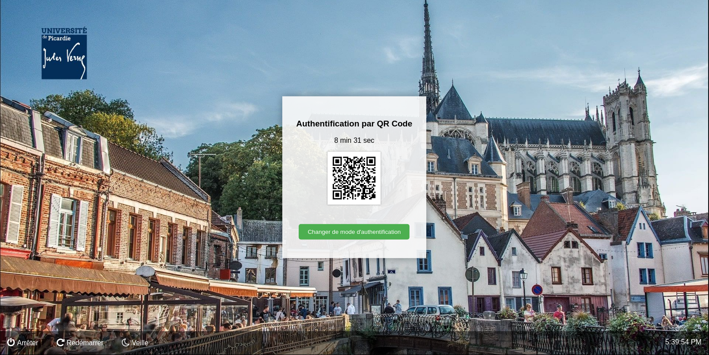

# linux-qrcode-login
Authenticate yourself to your Debian Desktop machine with a QR code!




## How to

**Build package**

```bash
dpkg-deb --build qrcode-authenticator
```

**Install package**

*You need to have python3 and libcairo2 (pre-installed on Debian 11).*

```bash
sudo apt update
sudo apt -o Dpkg::Options::="--force-overwrite" install ./qrcode-authenticator.deb
```

